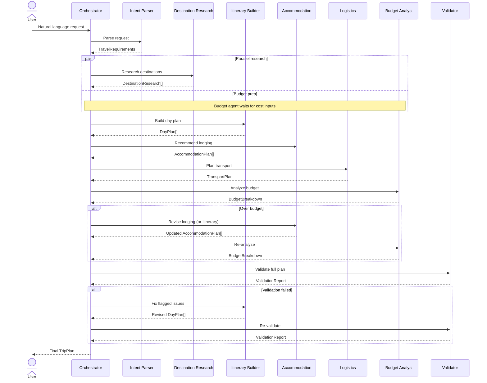
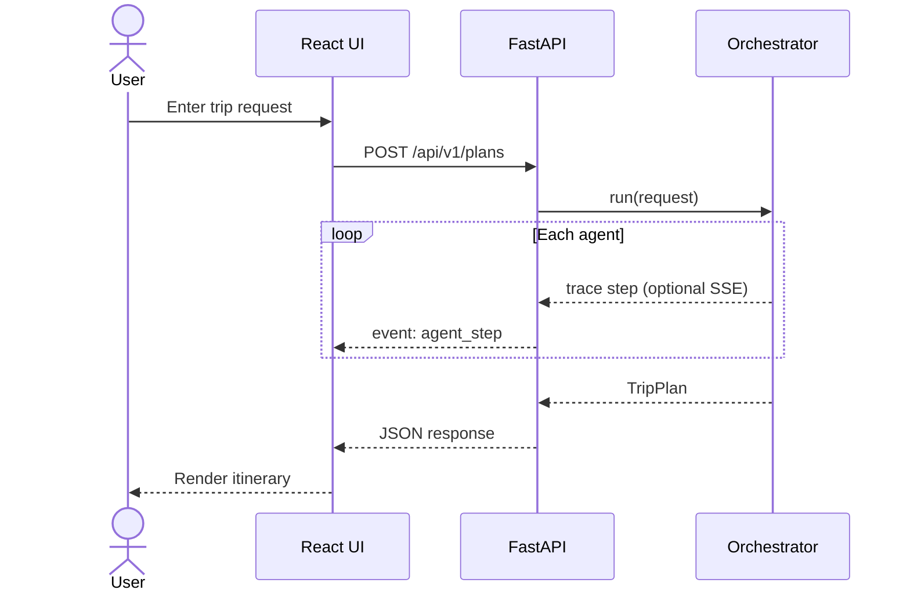

# Travel Planning Multi-Agent System — Architecture

This document describes the architecture for the **AI Travel Planner** defined in [problemStatement.md](./problemStatement.md). The design prioritizes clarity for product managers: each agent maps to a recognizable step in human trip planning.

---

## 1. System Overview

The system accepts a natural-language travel request and produces a structured trip plan. A central **Orchestrator** coordinates specialized agents that each own one slice of the planning problem. Agents share a common **Trip Context** (working memory) and pass typed artifacts between stages.

```
┌─────────────────────────────────────────────────────────────────┐
│                         User Request                            │
│  "5-day Japan. Tokyo + Kyoto. $3k. Food, temples, no crowds." │
└────────────────────────────┬────────────────────────────────────┘
                             │
                             ▼
┌─────────────────────────────────────────────────────────────────┐
│                      Orchestrator Agent                         │
│         Decomposes work, routes tasks, merges outputs           │
└───┬─────────┬─────────┬─────────┬─────────┬─────────┬───────────┘
    │         │         │         │         │         │
    ▼         ▼         ▼         ▼         ▼         ▼
 Intent   Destination  Itinerary  Accom-   Budget   Validator
 Parser    Research    Builder   modation  Analyst   Agent
 Agent     Agent       Agent     Agent     Agent
    │         │         │         │         │         │
    └─────────┴─────────┴────┬────┴─────────┴─────────┘
                             │
                             ▼
                    ┌─────────────────┐
                    │   Trip Context   │  (shared state)
                    └────────┬────────┘
                             │
                             ▼
┌─────────────────────────────────────────────────────────────────┐
│                      Final Trip Plan (output)                   │
│  day-by-day outline · neighborhoods · logistics · budget · QA   │
└─────────────────────────────────────────────────────────────────┘
```

### Design Principles

| Principle | Rationale |
|-----------|-----------|
| **One agent, one job** | Each agent has a narrow responsibility that PMs can name and reason about |
| **Typed handoffs** | Agents exchange structured JSON schemas, not free-form prose |
| **Shared Trip Context** | Avoid re-parsing the user request in every agent |
| **Validation loop** | A dedicated Validator can send work back for revision |
| **Simplicity over completeness** | Demo-quality plans, not production booking integration |

---

## 2. Agent Catalog

### 2.1 Orchestrator Agent

**Role:** Project manager for the trip plan. Owns the end-to-end workflow.

| Attribute | Detail |
|-----------|--------|
| **Input** | Raw user request (string) |
| **Output** | Final `TripPlan` document |
| **Responsibilities** | Invoke agents in order; handle retries when Validator fails; assemble the user-facing response |

**Workflow decisions:**

1. Run Intent Parser first — all downstream agents depend on structured requirements.
2. Run Destination Research and Budget Analyst in parallel (no dependency between them).
3. Run Itinerary Builder after Destination Research completes.
4. Run Accommodation Agent after Itinerary Builder proposes city/day splits.
5. Run Logistics Agent after cities and dates are known.
6. Run Validator last; on failure, re-invoke the specific agent(s) flagged by Validator (max 2 revision cycles).

---

### 2.2 Intent Parser Agent

**Maps to:** *Understanding the traveler's goals*

Extracts structured constraints and preferences from unstructured text.

| Attribute | Detail |
|-----------|--------|
| **Input** | Raw user request |
| **Output** | `TravelRequirements` |
| **Key extractions** | Duration, destinations, budget, interests, dislikes, travel style, party size (if mentioned), date flexibility |

**Example output:**

```json
{
  "duration_days": 5,
  "destinations": ["Tokyo", "Kyoto"],
  "budget_usd": 3000,
  "interests": ["food", "temples"],
  "dislikes": ["crowds"],
  "travel_style": "mid-range",
  "party_size": 1
}
```

**Fallback behavior:** If a required field is missing (e.g., no budget), infer a reasonable default and flag it as `assumed: true` so the Validator can surface it to the user.

---

### 2.3 Destination Research Agent

**Maps to:** *Researching destinations and attractions*

Researches what to see and do at each destination, filtered by user interests.

| Attribute | Detail |
|-----------|--------|
| **Input** | `TravelRequirements` |
| **Output** | `DestinationResearch[]` |
| **Responsibilities** | Curate attractions, neighborhoods, local tips; rank by interest fit; note crowd levels where relevant |

**Example output (per destination):**

```json
{
  "city": "Kyoto",
  "neighborhoods": [
    { "name": "Higashiyama", "fit_score": 0.9, "reason": "Temples, walkable, traditional" }
  ],
  "attractions": [
    { "name": "Fushimi Inari", "category": "temple", "crowd_level": "high", "best_time": "early morning" }
  ],
  "food_highlights": ["Nishiki Market", "kaiseki in Gion"]
}
```

---

### 2.4 Itinerary Builder Agent

**Maps to:** *Day-by-day trip outline*

Allocates days across cities and assigns activities to each day.

| Attribute | Detail |
|-----------|--------|
| **Input** | `TravelRequirements`, `DestinationResearch[]` |
| **Output** | `DayPlan[]` |
| **Responsibilities** | Split days between cities; sequence activities geographically; respect dislikes (e.g., schedule crowded sites off-peak) |

**Example output:**

```json
[
  {
    "day": 1,
    "city": "Tokyo",
    "theme": "Arrival & Shibuya",
    "activities": [
      { "time": "afternoon", "name": "Shibuya Crossing", "duration_hours": 1 },
      { "time": "evening", "name": "Ramen in Shinjuku", "duration_hours": 2 }
    ]
  }
]
```

---

### 2.5 Accommodation Agent

**Maps to:** *Comparing hotels and suggested neighborhoods*

Recommends areas to stay and example lodging options aligned with budget and itinerary.

| Attribute | Detail |
|-----------|--------|
| **Input** | `TravelRequirements`, `DayPlan[]`, `DestinationResearch[]` |
| **Output** | `AccommodationPlan[]` |
| **Responsibilities** | Pick neighborhoods per city segment; suggest 2–3 options per city within budget tier; explain trade-offs |

**Example output:**

```json
[
  {
    "city": "Tokyo",
    "nights": 3,
    "recommended_neighborhood": "Shinjuku",
    "reason": "Central transit hub, good food, fits mid-range budget",
    "options": [
      { "name": "Hotel Gracery Shinjuku", "price_per_night_usd": 120, "tier": "mid-range" }
    ]
  }
]
```

---

### 2.6 Logistics Agent

**Maps to:** *Travel logistics between cities*

Plans inter-city and intra-city transport.

| Attribute | Detail |
|-----------|--------|
| **Input** | `TravelRequirements`, `DayPlan[]`, `AccommodationPlan[]` |
| **Output** | `TransportPlan` |
| **Responsibilities** | Inter-city routes (e.g., Tokyo → Kyoto via Shinkansen); airport transfers; estimated costs and durations |

**Example output:**

```json
{
  "inter_city": [
    {
      "from": "Tokyo",
      "to": "Kyoto",
      "mode": "Shinkansen",
      "duration_hours": 2.5,
      "estimated_cost_usd": 120,
      "suggested_day": 4
    }
  ],
  "local_transit_notes": "Get a Suica/PASMO card in Tokyo; Kyoto bus day pass recommended"
}
```

---

### 2.7 Budget Analyst Agent

**Maps to:** *Staying within budget*

Estimates total trip cost and flags overruns with savings suggestions.

| Attribute | Detail |
|-----------|--------|
| **Input** | `TravelRequirements`, `AccommodationPlan[]`, `TransportPlan`, `DayPlan[]` |
| **Output** | `BudgetBreakdown` |
| **Responsibilities** | Itemize lodging, transport, food, activities; compare to user budget; suggest swaps if over budget |

**Example output:**

```json
{
  "budget_usd": 3000,
  "estimated_total_usd": 2750,
  "breakdown": {
    "lodging": 960,
    "transport": 350,
    "food": 900,
    "activities": 340,
    "buffer": 200
  },
  "status": "within_budget",
  "savings_suggestions": []
}
```

If `status` is `over_budget`, the Orchestrator triggers a revision: Accommodation Agent or Itinerary Builder adjusts based on `savings_suggestions`.

---

### 2.8 Validator Agent

**Maps to:** *Checking whether the final itinerary matches the request*

Quality gate before the plan is returned to the user.

| Attribute | Detail |
|-----------|--------|
| **Input** | Original user request, `TravelRequirements`, all agent outputs |
| **Output** | `ValidationReport` |
| **Checks** | Duration matches; all destinations visited; budget respected; interests covered; dislikes honored; plan is internally consistent |

**Example output:**

```json
{
  "passed": false,
  "issues": [
    {
      "severity": "error",
      "check": "dislikes",
      "message": "Day 2 schedules Senso-ji at midday — high crowd period",
      "suggested_agent": "itinerary_builder"
    }
  ]
}
```

On failure, Orchestrator routes `issues` to the named agent(s) and re-runs Validator.

---

## 3. Shared State — Trip Context

All agents read from and write to a single **Trip Context** object. The Orchestrator owns lifecycle and versioning.

```json
{
  "session_id": "uuid",
  "raw_request": "...",
  "requirements": { },
  "destination_research": [ ],
  "day_plans": [ ],
  "accommodation": [ ],
  "transport": { },
  "budget": { },
  "validation": { },
  "revision_count": 0,
  "status": "in_progress | complete | failed"
}
```

| Field | Written by | Read by |
|-------|-----------|---------|
| `requirements` | Intent Parser | All agents |
| `destination_research` | Destination Research | Itinerary Builder, Accommodation |
| `day_plans` | Itinerary Builder | Accommodation, Logistics, Budget, Validator |
| `accommodation` | Accommodation | Logistics, Budget, Validator |
| `transport` | Logistics | Budget, Validator |
| `budget` | Budget Analyst | Orchestrator, Validator |
| `validation` | Validator | Orchestrator |

---

## 4. Execution Flow

### 4.1 Happy Path (Sequence)



### 4.2 Phase Summary

| Phase | Agents | Parallel? |
|-------|--------|-----------|
| 1 — Understand | Intent Parser | No |
| 2 — Research | Destination Research | Yes (standalone) |
| 3 — Plan | Itinerary Builder → Accommodation → Logistics | Sequential |
| 4 — Cost | Budget Analyst | No (needs prior outputs) |
| 5 — QA | Validator (+ optional revision loop) | No |

---

## 5. Final Output Schema — `TripPlan`

The Orchestrator assembles this user-facing document from Trip Context.

```json
{
  "summary": "5-day Tokyo & Kyoto trip focused on food and temples, ~$2,750 of $3,000 budget",
  "day_by_day": [ /* DayPlan[] */ ],
  "neighborhoods_to_stay": [ /* from AccommodationPlan[] */ ],
  "logistics": { /* TransportPlan */ },
  "budget": { /* BudgetBreakdown */ },
  "assumptions": [
    "Party size assumed to be 1 traveler",
    "Mid-range lodging tier inferred from budget"
  ],
  "validation_passed": true
}
```

This maps directly to the problem statement deliverables:

| Deliverable | Source |
|-------------|--------|
| Day-by-day trip outline | `day_by_day` |
| Suggested neighborhoods / areas to stay | `neighborhoods_to_stay` |
| Travel logistics between cities | `logistics.inter_city` |
| Budget-friendly recommendations | `budget.savings_suggestions` + lodging tiers |
| Final itinerary respecting preferences | Full `TripPlan` after Validator passes |

---

## 6. Communication Patterns

### 6.1 Agent-to-Agent

Agents do **not** call each other directly. All communication is mediated by the Orchestrator via Trip Context. This keeps the system easy to trace and debug.

### 6.2 Agent Prompt Structure

Each agent receives a consistent prompt envelope:

```
SYSTEM: You are the {Agent Name}. Your job is {one-line role}.
        Output valid JSON matching schema: {schema_ref}.

CONTEXT:
  - User request: {raw_request}
  - Travel requirements: {requirements}
  - Relevant prior outputs: {scoped_context}

TASK: {specific_instruction}

CONSTRAINTS: {agent-specific rules}
```

### 6.3 Tool Access (Optional Extensions)

| Agent | Suggested tools (future) |
|-------|--------------------------|
| Destination Research | Web search, Wikipedia, travel APIs |
| Accommodation | Hotel search API (mock for demo) |
| Logistics | Maps / transit API (mock for demo) |
| Budget Analyst | Currency converter, price lookup |

For the initial demo, agents can rely on LLM world knowledge without live API calls.

---

## 7. Project Structure (Recommended)

```
travel-agent/
├── docs/
│   ├── problemStatement.md
│   ├── architecture.md          ← this file
│   └── implementation-plan.md   ← phase-wise build plan (incl. Phase 6 frontend)
├── frontend/                    ← Phase 6: Next.js or Vite + React UI
│   ├── app/ or src/
│   ├── package.json
│   └── railway.toml
├── src/
│   ├── api/                     ← Phase 6: FastAPI REST layer
│   │   ├── main.py              # Uvicorn entry: uvicorn src.api.main:app
│   │   ├── routes/plans.py
│   │   ├── schemas.py
│   │   └── service.py           # Wraps Orchestrator.run()
│   ├── data/                    ← Phase 4: seed + live providers
│   ├── render/                  ← Markdown + terminal output
│   ├── orchestrator.py
│   ├── context.py
│   ├── agents/
│   ├── llm/
│   ├── schemas/
│   └── main.py                  # CLI entry point (Typer)
├── data/seeds/                  ← Tokyo, Kyoto seed catalogs
├── prompts/
├── examples/                    ← Demo shell scripts
├── tests/
├── Dockerfile                   ← Phase 6
├── docker-compose.yml           ← Phase 6
├── render.yaml                  ← Phase 6 (optional Render deploy)
└── requirements.txt
```

---

## 8. Technology Stack

| Layer | Current (Phases 0–5) | Phase 6 (Frontend + deploy) |
|-------|----------------------|-----------------------------|
| Language | Python 3.9+ | Python (API) + TypeScript (UI) |
| LLM | Groq (planning) + Gemini (review) | Same — keys on server only |
| Schemas | Pydantic v2 | Same + FastAPI request/response models |
| Orchestration | Custom Python Orchestrator | Unchanged — called from API service |
| CLI | Typer | Kept for dev/debug |
| API | — | FastAPI + Uvicorn |
| Frontend | — | Next.js 14 or Vite + React + Tailwind |
| Streaming | — | SSE for agent trace (optional v1.1) |
| Logging | structlog | Same + request IDs in API |
| Hosting | Local | Render (API) + Railway (UI) |
| Containers | — | Docker + docker-compose |

---

## 9. Error Handling & Limits

| Scenario | Behavior |
|----------|----------|
| Intent Parser cannot extract destinations | Return clarifying question to user; do not proceed |
| Agent returns invalid JSON | Retry once with schema error feedback; then fail gracefully |
| Budget consistently over limit after 2 revisions | Return best-effort plan with explicit over-budget warning |
| Validator fails after 2 revision cycles | Return plan with `validation_passed: false` and listed issues |
| LLM timeout / API error | Orchestrator retries agent once; surfaces error to user if persistent |

**Guardrails:**

- Max revision loops: **2** (budget + validation)
- Max total agent calls per request: **~15** (prevents runaway cost)
- All assumed/inferred fields must appear in `assumptions[]`

---

## 10. Observability (Demo-Friendly)

For PM audiences, expose a simple **execution trace**:

```
[1] Intent Parser      → extracted 5-day, Tokyo+Kyoto, $3k budget
[2] Destination Research → 12 attractions across 2 cities
[3] Itinerary Builder  → 5 day plans created
[4] Accommodation      → Shinjuku (Tokyo), Higashiyama (Kyoto)
[5] Logistics          → Shinkansen Tokyo→Kyoto on Day 4
[6] Budget Analyst     → $2,750 / $3,000 (within budget)
[7] Validator          → PASSED
```

This trace makes the multi-agent collaboration tangible without requiring users to read JSON.

---

## 11. Future Extensions

| Extension | Phase | Notes |
|-----------|-------|-------|
| Web UI with live agent trace | **Phase 6** | FastAPI + React — see §13–15 |
| User chat loop for clarifying questions | Phase 7+ | Before planning starts |
| Real booking API integration | Phase 7+ | Amadeus, Booking.com affiliate |
| Multi-traveler preference negotiation | Phase 7+ | |
| Persistent user profiles / trip history | Phase 7+ | Requires auth + database |
| Background job queue for long plans | Phase 6.1+ | Redis + worker if sync POST times out |

---

## 12. Summary

The architecture decomposes trip planning into **seven specialized agents** coordinated by an **Orchestrator**, with a shared **Trip Context** and a **Validator** quality gate. Each agent maps cleanly to a step product managers already understand, and the final `TripPlan` output satisfies every deliverable in the problem statement.

**Phase 6** adds a **FastAPI REST layer** and **web frontend** without changing agents — the UI consumes the same `TripPlan` JSON and execution trace the CLI already produces.

---

## 13. Web & API Layer (Phase 6)

The CLI (`src/main.py`) proves the pipeline works. Phase 6 exposes the same capabilities over HTTP so a browser can call it.

### 13.1 Layered architecture

```
┌─────────────────────────────────────────────────────────────────┐
│                     Frontend (Next.js / React)                   │
│  Request form · Agent trace panel · Itinerary · Budget · Export  │
└────────────────────────────┬────────────────────────────────────┘
                             │ HTTPS (JSON / SSE)
                             ▼
┌─────────────────────────────────────────────────────────────────┐
│                     API Gateway (FastAPI)                        │
│  Validation · CORS · Rate limits · Error mapping · Auth (opt.)   │
└────────────────────────────┬────────────────────────────────────┘
                             │
                             ▼
┌─────────────────────────────────────────────────────────────────┐
│                     Plan Service (src/api/service.py)            │
│  Maps HTTP body → Orchestrator options (dry_run, data_mode, …)   │
└────────────────────────────┬────────────────────────────────────┘
                             │
                             ▼
┌─────────────────────────────────────────────────────────────────┐
│              Orchestrator + Agents (unchanged)                     │
└────────────────────────────┬────────────────────────────────────┘
                             │
                             ▼
                      TripPlan + Trace
```

### 13.2 Design principles

| Principle | Rationale |
|-----------|-----------|
| **Thin API** | No business logic in routes — delegate to `Orchestrator` |
| **Same schemas** | API returns existing `TripPlan` Pydantic models |
| **Keys on server** | `GROQ_API_KEY` / `GEMINI_API_KEY` never sent to browser |
| **CLI parity** | Every CLI flag has an API field equivalent |
| **Streaming optional** | Sync POST for MVP; SSE for live trace in v1.1 |

### 13.3 API endpoints (v1)

| Method | Path | Purpose |
|--------|------|---------|
| `POST` | `/api/v1/plans` | Create trip plan (sync) |
| `GET` | `/api/v1/plans/{session_id}/events` | SSE agent trace (v1.1) |
| `GET` | `/health` | Load balancer health check |
| `GET` | `/api/v1/plans/{session_id}/markdown` | Download rendered Markdown |

**Request body (`POST /api/v1/plans`):**

```json
{
  "request": "Plan a 5-day trip to Japan. Tokyo + Kyoto. $3,000 budget...",
  "dry_run": false,
  "intent_only": false,
  "planning_only": false,
  "data_mode": "auto"
}
```

**Response:** `{ session_id, status, trip_plan, trace, quota, data_provenance }`

### 13.4 Service layer (sketch)

```python
# src/api/service.py
def create_plan(body: PlanRequest) -> PlanResponse:
    phase = _resolve_phase(body)  # dry_run → PHASE_STUB, etc.
    orchestrator = Orchestrator(phase=phase, data_mode=body.data_mode)
    trip_plan, context = orchestrator.run(body.request)
    return PlanResponse.from_context(trip_plan, context)
```

The CLI and API both call the same function — no duplicated orchestration logic.

---

## 14. Frontend Architecture (Phase 6)

### 14.1 Recommended approach: Next.js + Tailwind

| Alternative | When to use |
|-------------|-------------|
| **Next.js + Tailwind** (recommended) | Shareable demo, Railway deploy, polished UI |
| **Vite + React** | Lighter bundle if you skip SSR |
| **Streamlit** | 1-day internal hackathon only — hard to customize |

### 14.2 Page structure

| Route | Components |
|-------|------------|
| `/` | `TripForm`, example prompt chips, dry-run toggle |
| `/plan/[id]` | `AgentTrace`, `DayCard[]`, `LodgingSection`, `BudgetBar`, `ValidationBadge` |
| `/demo` | Pre-filled dry-run → instant stub itinerary |

### 14.3 Key UI states

```
idle → submitting → running (show trace) → complete | failed
```

- **Running:** Disable form; show spinner + trace steps as they arrive (SSE) or after completion (sync).
- **Complete:** Render itinerary; green validation badge if `validation_passed`.
- **Failed:** Show `summary` error + suggestion to try dry-run or simplify request.

### 14.4 Data flow



### 14.5 Reuse existing renderers

| Output | Source | Use in UI |
|--------|--------|-----------|
| Structured data | `TripPlan` JSON | React components (day cards, budget chart) |
| Markdown export | `render_trip_markdown()` | Download button |
| Plain text | `render_trip_terminal()` | Optional "simple view" |

---

## 15. Deployment Architecture (Phase 6)

### 15.1 Target topology (recommended)

```
                    ┌──────────────┐
                    │   Railway    │
                    │  (frontend)  │
                    │   Next.js    │
                    └──────┬───────┘
                           │ HTTPS
                           ▼
                    ┌──────────────┐
                    │ Render/Railway│
                    │  (FastAPI)   │
                    │  Python 3.11 │
                    └──────┬───────┘
                           │
              ┌────────────┼────────────┐
              ▼            ▼            ▼
         Groq API    Gemini API   OpenTripMap (opt.)
```

**Why split:** Frontend on Railway (Next.js, one dashboard with your other projects); API on Render (native Python, Blueprint IaC, long-running requests).

### 15.2 Environment variables

| Variable | Where | Purpose |
|----------|-------|---------|
| `GROQ_API_KEY` | API server only | Planning agents |
| `GEMINI_API_KEY` | API server only | Budget + Validator |
| `ALLOWED_ORIGINS` | API server | CORS — e.g. `https://your-app.up.railway.app` |
| `NEXT_PUBLIC_API_URL` | Frontend build | API base URL |
| `API_SECRET` | API server (optional) | Protect public deploy from abuse |
| `DATA_MODE` | API server | `auto` / `seed` / `live` |

### 15.3 Docker (local + portable)

```yaml
# docker-compose.yml (conceptual)
services:
  api:
    build: .
    ports: ["8000:8000"]
    env_file: .env
  frontend:
    build: ./frontend
    ports: ["3000:3000"]
    environment:
      NEXT_PUBLIC_API_URL: http://localhost:8000
```

Single command: `docker compose up --build`

### 15.4 Deploy checklist

1. [ ] API responds to `GET /health`
2. [ ] `POST /api/v1/plans` with `dry_run: true` works without LLM keys
3. [ ] CORS allows frontend origin
4. [ ] Frontend `NEXT_PUBLIC_API_URL` points to deployed API
5. [ ] Secrets set in platform dashboard (not in git)
6. [ ] Request timeout ≥ 120s (planning takes 30–90s live)

### 15.5 Cost & quota on public deploy

| Risk | Mitigation |
|------|------------|
| Gemini 20 RPD | Default public demo to `dry_run: true`; show quota in UI |
| Groq abuse | Optional `API_SECRET`; rate limit per IP |
| Long requests | Loading UI + 120s timeout; SSE so user sees progress |

### 15.6 Future production upgrades

| Need | Solution |
|------|----------|
| Async jobs | Redis + Celery/RQ worker; `POST` returns `job_id`, poll `GET /jobs/{id}` |
| Auth | Clerk, Auth0, or simple API keys per user |
| Database | PostgreSQL for plan history (`session_id`, `trip_plan`, `created_at`) |
| CDN caching | Cache dry-run responses only — live plans are unique |
