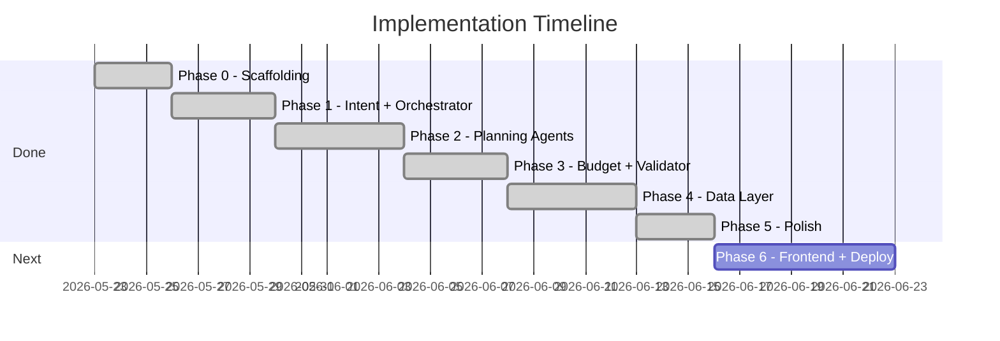

# Travel Planning Multi-Agent System — Implementation Plan

This document defines a **phase-wise build plan** for the AI Travel Planner described in [problemStatement.md](./problemStatement.md) and [architecture.md](./architecture.md).

Each phase produces a demoable increment. Later phases add data realism and production hardening without rewriting earlier work.

---

## Current scope — LLM-only data (extend phases incrementally)

**Decision:** Phases 0–5 use Groq + Gemini for planning and review. **Phase 4** adds optional seed files and OpenTripMap; agents still accept LLM fallback for cities without seeds.

**Multi-model strategy ("two brains"):** Planning agents use **Groq**; budget and validation use **Gemini**.

### What's implemented now

| Phase | Status | Data source | Interface |
|-------|--------|-------------|-----------|
| **0 — Foundation** | ✅ Done | Stubs | CLI |
| **1 — Intent Parser** | ✅ Done | Groq LLM | CLI |
| **2 — Planning agents** | ✅ Done | Groq LLM | CLI |
| **3 — Budget + Validator** | ✅ Done | Gemini LLM | CLI |
| **4 — Data layer** | ✅ Done | Seeds + optional OpenTripMap | CLI `--data-mode` |
| **5 — Polish & demo** | ✅ Done | — | CLI `--dry-run`, readable output, e2e tests |
| **6 — Frontend + deploy** | ✅ Done | — | Web UI + hosted API |

### Extension path

Build one phase at a time. Each phase plugs into the existing Orchestrator and Trip Context — **no rewrites** when adding the next phase.

```
Phases 0–5 (DONE)                Phase 6 (NEXT)
─────────────────                ─────────────────────────────────────
CLI (Typer)                      FastAPI REST API  ← wraps Orchestrator
    │                                │
    ▼                                ▼
Orchestrator + 7 agents          React/Next.js UI  ← chat + itinerary + trace
    │                                │
    ▼                                ▼
TripPlan JSON                    Deploy: Render/Railway (API) + Vercel (UI)
```

| Complete | Next |
|----------|------|
| Full multi-agent pipeline (Groq + Gemini) | HTTP API layer (`src/api/`) |
| Seed data + provenance (Phase 4) | Web frontend (`frontend/`) |
| CLI polish + e2e tests (Phase 5) | Docker + cloud deployment |

**Current milestone:** Phases 0–5 complete. **Next recommended step:** Phase 6 — FastAPI wrapper + web UI + deployment.

**Why API first:** The Orchestrator and agents stay unchanged. The frontend calls the same `TripPlan` JSON the CLI already produces.

---

## Multi-Model LLM Strategy

Two model backends act as distinct "brains" in the pipeline. The Orchestrator routes each agent to the correct provider via a model registry in `BaseAgent`.

```
┌─────────────────────────────────────────────────────────────────┐
│                    BRAIN 1 — Groq (Planning)                    │
│  Intent Parser · Destination Research · Itinerary Builder       │
│  Accommodation · Logistics                                      │
└────────────────────────────┬────────────────────────────────────┘
                             │  Trip Context (typed artifacts)
                             ▼
┌─────────────────────────────────────────────────────────────────┐
│                   BRAIN 2 — Gemini (Review)                     │
│  Budget Analyst · Validator                                     │
└─────────────────────────────────────────────────────────────────┘
```

### Agent-to-model mapping

| Agent | Provider | Model (default) | Role |
|-------|----------|-----------------|------|
| Intent Parser | **Groq** | `llama-3.3-70b-versatile` | Parse user request into structured requirements |
| Destination Research | **Groq** | `llama-3.3-70b-versatile` | Research attractions, neighborhoods, food |
| Itinerary Builder | **Groq** | `llama-3.3-70b-versatile` | Build day-by-day activity plan |
| Accommodation | **Groq** | `llama-3.3-70b-versatile` | Recommend neighborhoods and lodging |
| Logistics | **Groq** | `llama-3.3-70b-versatile` | Plan inter-city and local transport |
| Budget Analyst | **Gemini** | `gemini-3-flash` | Itemize costs, check budget, suggest savings |
| Validator | **Gemini** | `gemini-3-flash` | Independent QA — plan vs original request |

> Default model IDs are suggestions; override via env vars. Swap models without changing agent code.

### Why this split works

| Concern | Groq (planning) | Gemini (review) |
|---------|-----------------|-----------------|
| Speed | Fast inference — good for 5 sequential planning agents | Fewer calls (budget + validator only) |
| Creativity | Strong at generating varied itineraries and options | — |
| Critical analysis | — | Second model won't rubber-stamp Groq's plan |
| Budget math | — | Better suited for structured cost breakdown |
| Validation | — | Fresh eyes on preferences, dislikes, consistency |

### Implementation notes

| # | Task | Output |
|---|------|--------|
| M.1 | Add `ModelProvider` enum (`groq`, `gemini`) | `src/llm/providers.py` |
| M.2 | Implement Groq client wrapper | Structured JSON output, retry on parse failure |
| M.3 | Implement Gemini client wrapper | Same interface as Groq client |
| M.4 | Agent config maps agent name → provider + model | `src/llm/agent_models.yaml` or dict in config |
| M.5 | `BaseAgent` accepts `provider` and `model` at init | Orchestrator injects per agent |
| M.6 | Trace log includes `provider` and `model` per agent step | Visible in `--trace` output for PM demo |

```yaml
# src/llm/agent_models.yaml (example)
intent_parser:
  provider: groq
  model: llama-3.3-70b-versatile
destination_research:
  provider: groq
  model: llama-3.3-70b-versatile
itinerary_builder:
  provider: groq
  model: llama-3.3-70b-versatile
accommodation:
  provider: groq
  model: llama-3.3-70b-versatile
logistics:
  provider: groq
  model: llama-3.3-70b-versatile
budget_analyst:
  provider: gemini
  model: gemini-3-flash
validator:
  provider: gemini
  model: gemini-3-flash
```

---

## API Rate Limits (Groq & Gemini)

> **Applies from Phase 1 onward** (when agents call live LLMs). Phase 0 stubs do not consume quota.

These are the **account-level limits** for our configured models. The Orchestrator and LLM client layer must enforce them to avoid `429` errors and silent daily exhaustion.

### Limit reference

| Provider | Model | RPM | TPM | RPD | TPD |
|----------|-------|-----|-----|-----|-----|
| **Groq** | `llama-3.3-70b-versatile` | 30 | 12,000 | 1,000 | 100,000 |
| **Gemini** | `gemini-3-flash` | 5 | 250,000 | **20** | — |

| Abbreviation | Meaning |
|--------------|---------|
| RPM | Requests per minute |
| TPM | Tokens per minute |
| RPD | Requests per day |
| TPD | Tokens per day |

### LLM calls per trip (estimate)

| Path | Groq calls | Gemini calls | Notes |
|------|------------|--------------|-------|
| Happy path | 5 | 2 | Intent → Dest → Itin → Accom → Log → Budget → Validator |
| + JSON retry (worst case) | +5 | +2 | One retry per agent on parse failure |
| + Budget revision loop (max 2) | +2 | +2 | Re-run Accommodation/Itinerary (Groq) + Budget (Gemini) |
| + Validation revision loop (max 2) | +2 | +2 | Re-run Itinerary (Groq) + Validator (Gemini) |
| **Worst case total** | **~14** | **~8** | Must stay under existing ~15 agent-call guardrail |

### Capacity planning

| Constraint | Groq | Gemini | Bottleneck? |
|------------|------|--------|-------------|
| Per minute | ~6 full trips (30 RPM ÷ 5 calls) | ~2 full trips (5 RPM ÷ 2 calls) | **Gemini RPM** |
| Per day | ~200 full trips (1K RPD ÷ 5 calls) | **~10 full trips** (20 RPD ÷ 2 calls) | **Gemini RPD — critical** |

**Gemini RPD (20) is the hard daily cap.** At 2 calls per trip, we can run roughly **10 demo trip plans per day** before quota is exhausted. Revision loops cut this further (~3–5 trips/day worst case).

### Design rules for Phases 1–3

| # | Rule | Rationale |
|---|------|-----------|
| RL-1 | Implement `RateLimiter` in `src/llm/rate_limiter.py` — track RPM/RPD per provider | Central enforcement before every LLM call |
| RL-2 | **Serialize Gemini calls** — never parallelize Budget + Validator | Gemini RPM is only 5 |
| RL-3 | **Keep revision loops at max 1** (not 2) for Gemini-backed steps | Saves Gemini RPD; Groq can keep max 2 |
| RL-4 | **No Gemini retries on 429** — fail fast with clear "daily quota exceeded" message | Retries burn RPD faster |
| RL-5 | Groq JSON parse retry stays at 1 — but only if RPM/RPD headroom exists | Avoid retry storms |
| RL-6 | Log quota usage in `--trace`: `gemini: 4/20 RPD used today` | PM/demo visibility |
| RL-7 | Add `--dry-run` flag (Phase 5) — stub agents, zero API calls | Dev/testing without burning quota |
| RL-8 | Compact prompts — target <2K tokens per Groq call | Stay under 12K TPM (Groq) |

### Rate limiter behavior

```
Before each LLM call:
  1. Check RPD — if exhausted → abort with user-friendly message
  2. Check RPM — if at limit → sleep until window resets
  3. Check TPM (optional estimate) — if near limit → queue/sleep
  4. Record call after success
  5. On HTTP 429 → exponential backoff (Groq only; Gemini → abort per RL-4)
```

### Phase implementation checklist

| Phase | Rate-limit task |
|-------|-----------------|
| **Phase 1** | Add `RateLimiter`; wire into Groq client; track Intent Parser calls |
| **Phase 2** | Extend limiter to all 5 Groq agents; log per-trip Groq usage in trace |
| **Phase 3** | Wire Gemini client to limiter; **reduce validation/budget revision loops to max 1**; surface RPD warnings when ≥80% daily quota used |
| **Phase 5** | Add `--dry-run`; show quota summary in CLI footer |

### Revised guardrails (accounting for limits)

| Guardrail | Previous | Revised | Why |
|-----------|----------|---------|-----|
| Max revision loops (budget) | 2 | **1** | Each loop costs 1 Groq + 1 Gemini call |
| Max revision loops (validation) | 2 | **1** | Same — protects Gemini RPD |
| Max total agent calls | ~15 | **12** | Tighter ceiling; typical happy path = 7 |
| Gemini calls per trip (target) | — | **≤ 3** | 2 happy path + 1 revision buffer |
| Groq calls per trip (target) | — | **≤ 7** | 5 happy path + 2 revision/retries |

### Environment additions (Phase 1+)

```bash
# Rate limit overrides (optional — defaults match provider quotas above)
GROQ_RPM=30
GROQ_RPD=1000
GROQ_TPM=12000
GEMINI_RPM=5
GEMINI_RPD=20
GEMINI_TPM=250000

# Fail when Gemini daily quota ≥ this percentage (default 80)
GEMINI_RPD_WARN_THRESHOLD=0.8
```

---

## Overview

| Phase | Name | Goal | Demo outcome | Status |
|-------|------|------|--------------|--------|
| 0 | Foundation | Project skeleton, schemas, shared context | Run empty pipeline end-to-end | ✅ **Done** |
| 1 | Core pipeline | Intent Parser + Orchestrator | Parse request → structured requirements | ✅ **Done** |
| 2 | Planning agents | Destination, Itinerary, Accommodation, Logistics | Day-by-day plan (Groq) | ✅ **Done** |
| 3 | Cost & quality | Budget Analyst + Validator + revision loops | Full validated plan (Gemini) | ✅ **Done** |
| 4 | Data layer | Seed files + optional live APIs | Traceable data sources | ✅ **Done** |
| 5 | Polish & demo | CLI UX, traces, sample scenarios | PM-ready CLI demo | ✅ **Done** |
| 6 | Frontend + deploy | REST API + web UI + hosting | Shareable web app | ✅ **Done** |

**Build order:** 0 → 1 → 2 → 3 → 4 → 5 → **6**. Phase 6 wraps the existing Orchestrator — no agent rewrites.



---

## Phase 0 — Foundation ✅

> **Status: Done.** Stub pipeline runs via `python3 -m src.main --stub "..."`.

**Goal:** Establish project structure, shared models, and agent interface so every later phase plugs in cleanly.

### Tasks

| # | Task | Output |
|---|------|--------|
| 0.1 | Initialize Python project (`pyproject.toml` or `requirements.txt`) | Dependencies: `pydantic`, `groq`, `google-generativeai`, `structlog`, `typer`, `pytest`, `pyyaml` |
| 0.2 | Create folder layout per [architecture.md §7](./architecture.md#7-project-structure-recommended) | `src/`, `src/llm/`, `prompts/`, `tests/` (no `data/` until Phase 4) |
| 0.3 | Define Pydantic schemas for all artifacts | `TravelRequirements`, `DestinationResearch`, `DayPlan`, `AccommodationPlan`, `TransportPlan`, `BudgetBreakdown`, `ValidationReport`, `TripPlan` |
| 0.4 | Implement `TripContext` model with read/write helpers | `src/context.py` |
| 0.5 | Implement `BaseAgent` abstract class | `run(context) -> context`, prompt loading, JSON parse + schema validation, single retry; accepts `provider` + `model` |
| 0.6 | Implement LLM provider layer | `src/llm/providers.py` — Groq + Gemini clients with shared interface (see [Multi-Model LLM Strategy](#multi-model-llm-strategy)) |
| 0.7 | Add agent-to-model config | `src/llm/agent_models.yaml` — maps each agent to Groq or Gemini |
| 0.8 | Stub all 7 agents + Orchestrator (return placeholder data) | Agents compile and run in sequence with correct provider routing |
| 0.9 | Add CLI entry point | `python -m src.main "Plan a 5-day trip..."` prints stub JSON |

### Exit criteria

- [x] One command runs Orchestrator → all agents → prints stub `TripPlan`
- [x] All schemas validated by unit tests
- [x] Execution trace logs each agent step **including provider and model used**

### Dependencies

None.

---

## Phase 1 — Core Pipeline (Intent + Orchestrator) ✅

> **Status: Done.** Live Groq Intent Parser; default CLI mode returns `requirements_only`. Use `--stub` for offline full pipeline.

**Goal:** Turn a natural-language request into structured requirements and wire the orchestration skeleton.

**Maps to problem statement:** *Understanding the traveler's goals*

### Tasks

| # | Task | Output |
|---|------|--------|
| 1.1 | Write Intent Parser system prompt | `prompts/intent_parser.md` |
| 1.2 | Implement Intent Parser agent with structured LLM output (**Groq**) | Extracts duration, destinations, budget, interests, dislikes, travel style, party size |
| 1.3 | Handle missing fields with defaults + `assumed: true` flags | Assumptions surfaced in final output |
| 1.4 | Implement Orchestrator phase routing (stub downstream agents) | Phase 1 → Intent only; later phases fill in |
| 1.5 | Implement `TripPlan` assembler (partial — requirements + placeholders) | User-facing JSON structure |
| 1.6 | Add guardrail: abort if no destinations extracted | Return clarifying question instead of empty plan |
| 1.7 | Unit tests for Intent Parser with 3 sample requests | Japan, Europe, domestic US examples |
| 1.8 | Wire Groq client to `RateLimiter` | Track RPM/RPD before each Intent Parser call (see [API Rate Limits](#api-rate-limits-groq--gemini)) |

### Sample test input

```
Plan a 5-day trip to Japan. Tokyo + Kyoto. $3,000 budget. Love food and temples, hate crowds.
```

### Expected output (Phase 1)

```json
{
  "requirements": {
    "duration_days": 5,
    "destinations": ["Tokyo", "Kyoto"],
    "budget_usd": 3000,
    "interests": ["food", "temples"],
    "dislikes": ["crowds"]
  },
  "status": "requirements_only"
}
```

### Exit criteria

- [x] Intent Parser correctly extracts fields from the canonical Japan example
- [x] Orchestrator logs phase transitions
- [x] Invalid/empty requests return a helpful message
- [x] Groq `RateLimiter` blocks or queues when RPM/RPD exceeded

### Dependencies

Phase 0 complete.

---

## Phase 2 — Planning Agents ✅

> **Status: Done.** All four agents use Groq LLM with optional Phase 4 seed injection in prompts.

**Goal:** Produce a coherent day-by-day plan with neighborhoods and transport — without budget enforcement or validation yet.

**Maps to problem statement:**

- *Researching destinations and attractions*
- *Comparing hotels and transport options* (recommendations, not booking)
- *Day-by-day trip outline*
- *Suggested neighborhoods / areas to stay*
- *Travel logistics between cities*

### Tasks

| # | Task | Agent | Output |
|---|------|-------|--------|
| 2.1 | Write agent prompts | Destination Research | `prompts/destination_research.md` |
| 2.2 | Implement Destination Research agent | Destination Research (**Groq**) | `DestinationResearch[]` per city |
| 2.3 | Write Itinerary Builder prompt | Itinerary Builder | `prompts/itinerary_builder.md` |
| 2.4 | Implement Itinerary Builder | Itinerary Builder (**Groq**) | `DayPlan[]` with activities, themes, crowd-aware timing |
| 2.5 | Write Accommodation prompt | Accommodation | `prompts/accommodation.md` |
| 2.6 | Implement Accommodation agent | Accommodation (**Groq**) | `AccommodationPlan[]` with neighborhoods + 2–3 options |
| 2.7 | Write Logistics prompt | Logistics | `prompts/logistics.md` |
| 2.8 | Implement Logistics agent | Logistics (**Groq**) | `TransportPlan` with inter-city + local notes |
| 2.9 | Wire Orchestrator sequential flow | Orchestrator | Intent → Dest → Itin → Accom → Log |
| 2.10 | LLM-only prompts — no external data calls | All planning agents use **Groq** | See [Current Data Approach](#current-data-approach-llm-only) |
| 2.11 | Integration test: Japan example end-to-end | — | 5-day plan with 2 cities |
| 2.12 | Integration test: Indian city example (Jaipur) | — | Confirms LLM works without seed files |
| 2.13 | Log Groq quota usage per trip in execution trace | Orchestrator | e.g. `groq: 5/1000 RPD` (see [API Rate Limits](#api-rate-limits-groq--gemini)) |

### Orchestrator flow (Phase 2)

```
Intent Parser → Destination Research → Itinerary Builder → Accommodation → Logistics → assemble TripPlan
```

### Exit criteria

- [ ] Japan example produces 5 `DayPlan` entries covering Tokyo and Kyoto
- [ ] Each city has a recommended neighborhood and lodging options
- [ ] Inter-city Shinkansen leg appears in `TransportPlan`
- [ ] Interests (food, temples) appear in activities
- [ ] Crowd dislikes reflected in activity timing where possible

### Dependencies

Phase 1 complete.

---

## Phase 3 — Cost & Quality ✅

> **Status: Done.** Budget Analyst + Validator on Gemini; revision loops (max 1 each).

**Goal:** Enforce budget constraints and validate the final plan against the original request.

**Maps to problem statement:**

- *Staying within budget*
- *Checking whether the final itinerary matches the request*
- *Budget-friendly recommendations*
- *Final itinerary that respects preferences and constraints*

### Tasks

| # | Task | Agent | Output |
|---|------|-------|--------|
| 3.1 | Write Budget Analyst prompt | Budget Analyst | `prompts/budget_analyst.md` |
| 3.2 | Implement Budget Analyst (LLM-estimated costs) | Budget Analyst (**Gemini**) | `BudgetBreakdown` with itemized costs from model reasoning |
| 3.3 | Implement over-budget revision loop in Orchestrator | Orchestrator | Re-invoke Accommodation or Itinerary (**max 1 cycle** — Gemini RPD limit) |
| 3.4 | Write Validator prompt | Validator | `prompts/validator.md` |
| 3.5 | Implement Validator with check categories | Validator (**Gemini**) | duration, destinations, budget, interests, dislikes, consistency |
| 3.6 | Implement validation revision loop | Orchestrator | Route issues to `suggested_agent`, re-validate (**max 1 cycle**) |
| 3.7 | Finalize `TripPlan` assembler | Orchestrator | All fields populated including `assumptions`, `validation_passed` |
| 3.8 | Add guardrails + rate limits | Orchestrator | Max 12 agent calls, max 1 revision loop; Gemini RPD tracking (see [API Rate Limits](#api-rate-limits-groq--gemini)) |
| 3.9 | Integration tests | — | Within-budget case, over-budget case, validation failure case |

### Validation checks

| Check | Rule |
|-------|------|
| Duration | `len(day_plans) == requirements.duration_days` |
| Destinations | Every listed city appears in at least one day plan |
| Budget | `estimated_total_usd <= budget_usd` (or flagged with suggestions) |
| Interests | Each interest represented in ≥1 activity or food highlight |
| Dislikes | Crowded sites not scheduled at peak times |
| Consistency | Transport `suggested_day` matches itinerary city transitions |

### Exit criteria

- [ ] Japan example completes with `validation_passed: true` and `status: within_budget`
- [ ] Over-budget scenario triggers revision and `savings_suggestions`
- [ ] Failed validation re-runs Itinerary Builder and passes on second attempt (within 1 revision limit)
- [ ] Full execution trace shows all 7 agents **with Groq/Gemini provider labels and quota usage**
- [ ] Gemini RPD warning surfaced when daily quota ≥ 80% consumed

### Dependencies

Phase 2 complete.

---

## Phase 4 — Data Layer ✅

> **Status: Done.** Seed files for Tokyo/Kyoto, `DataRegistry`, optional OpenTripMap, computed budget, provenance in output.

**Goal:** Replace pure LLM guessing with **traceable, structured data** for destinations, accommodation, transport, and budget. Each recommendation should cite its data source.

See [Future Data Strategy](#future-data-strategy-deferred) below for full detail.

### Tasks

| # | Task | Output |
|---|------|--------|
| 4.1 | Define `DataProvider` interface | `src/data/base.py` — `fetch(query) -> structured result` |
| 4.2 | Implement Destination data provider | `src/data/destination.py` |
| 4.3 | Implement Accommodation data provider | `src/data/accommodation.py` |
| 4.4 | Implement Transport data provider | `src/data/transport.py` |
| 4.5 | Implement Budget benchmarks provider | `src/data/budget.py` |
| 4.6 | Add static seed datasets | `data/seeds/` — cities, routes, price tiers |
| 4.7 | Inject providers into agents via dependency injection | Agents call tools/providers before LLM synthesis |
| 4.8 | Add `data_sources[]` field to agent outputs | Traceability in final plan |
| 4.9 | Optional: wire one live API (e.g., OpenTripMap or Amadeus) | Configurable via env vars |
| 4.10 | Fallback chain: live API → seed data → LLM estimate (flagged) | Resilient fetching |

### Exit criteria

- [ ] Each agent output includes `data_sources` with provider name and freshness
- [ ] System runs fully offline using seed data
- [ ] Live API mode works when API keys are configured
- [ ] Budget breakdown uses computed totals from provider data, not LLM-only guesses

### Dependencies

Phase 3 complete.

---

## Phase 5 — Polish & Demo ✅

> **Status: Done.** CLI readable output, `--dry-run`, example scripts, README, e2e tests.

**Goal:** Make the system easy to demo to product managers and reliable enough for repeated runs.

### Tasks

| # | Task | Output | Status |
|---|------|--------|--------|
| 5.1 | Rich CLI output (Markdown or formatted text) | `src/render/terminal.py` | ✅ |
| 5.2 | `--trace` flag for agent execution log | PM-friendly step log | ✅ |
| 5.3 | `--json` flag for raw output | Developer/debug mode | ✅ |
| 5.4 | Sample scenario scripts | `examples/*.sh` | ✅ |
| 5.5 | README with setup, env vars, and demo instructions | Root `README.md` | ✅ |
| 5.6 | End-to-end test suite | `tests/test_e2e.py` | ✅ |
| 5.7 | Error messages and edge cases | Empty input, quota exceeded hints | ✅ |
| 5.8 | Optional: simple Streamlit/Gradio UI | Deferred to Phase 6 (use React instead) | ⏸ |
| 5.9 | Add `--dry-run` flag | Zero API calls offline demo | ✅ |

### Exit criteria

- [x] Non-technical user can run one command and read the trip plan
- [x] `--trace` clearly shows multi-agent collaboration
- [x] All problem statement deliverables visible in output
- [x] 3 sample scenarios pass e2e tests

### Dependencies

Phase 3 complete.

---

## Phase 6 — Frontend & Deployment ✅

> **Status: Done.** FastAPI wraps Orchestrator; Next.js UI with form, trace, itinerary; Docker + Render/Vercel configs.

**Goal:** Let anyone use the travel planner in a browser — with live agent trace, readable itinerary, and a shareable hosted URL.

**Maps to problem statement:** Same deliverables as CLI, presented in a UI non-technical users can use without a terminal.

### Architecture (high level)

See [architecture.md §13–15](./architecture.md#13-web--api-layer) for full detail.

```
Browser (React/Next.js)
    │  POST /api/v1/plans
    │  GET  /api/v1/plans/{id}/stream  (SSE — agent trace)
    ▼
FastAPI (src/api/)
    │  validates request, rate-limits, runs Orchestrator
    ▼
Orchestrator + 7 agents  (unchanged)
    ▼
TripPlan JSON → UI renders day-by-day, budget, validation
```

### Recommended stack

| Layer | Choice | Why |
|-------|--------|-----|
| **API** | FastAPI + Uvicorn | Native Python; wraps existing `Orchestrator.run()` |
| **Frontend** | Next.js 14 (App Router) or Vite + React | Component ecosystem, easy Vercel deploy |
| **Styling** | Tailwind CSS | Fast iteration; matches itinerary layout needs |
| **Streaming** | Server-Sent Events (SSE) | Push agent trace steps to UI during 30–90s runs |
| **Hosting (API)** | [Render](https://render.com) or [Railway](https://railway.app) | Simple Python deploy, env secrets, free tier |
| **Hosting (UI)** | [Vercel](https://vercel.com) or Netlify | Static/SSR frontend, CDN |
| **Container** | Docker + `docker-compose.yml` | Local prod-like stack; optional single-service deploy |

**Alternative (fastest MVP, ~1 day):** Streamlit app in `frontend/streamlit_app.py` calling Orchestrator directly — good for internal demo only; harder to style and scale. Prefer FastAPI + React for a shareable product demo.

### Tasks

| # | Task | Output |
|---|------|--------|
| 6.1 | Extract API service layer | `src/api/service.py` — `create_plan(request, options) -> PlanResponse` |
| 6.2 | FastAPI app + routes | `src/api/main.py`, `src/api/routes/plans.py` |
| 6.3 | Request/response models | `src/api/schemas.py` — mirrors CLI flags (`dry_run`, `data_mode`, etc.) |
| 6.4 | SSE streaming for agent trace | `GET /api/v1/plans/{id}/events` — emit trace steps as they happen |
| 6.5 | CORS + env-based config | `ALLOWED_ORIGINS`, API keys server-side only |
| 6.6 | Frontend scaffold | `frontend/` — Next.js or Vite project |
| 6.7 | Trip request form | Text area + example chips (Japan, Jaipur, Europe) |
| 6.8 | Live agent trace panel | Step list updating via SSE (Groq/Gemini labels) |
| 6.9 | Itinerary view | Day cards, lodging, logistics, budget, validation badge |
| 6.10 | Export actions | Download Markdown / JSON (reuse `render_trip_markdown`) |
| 6.11 | Dry-run toggle in UI | Demo mode without API keys |
| 6.12 | Dockerfile + compose | `Dockerfile`, `docker-compose.yml` (api + optional frontend) |
| 6.13 | Deploy API to Render/Railway | `render.yaml` or Railway config |
| 6.14 | Deploy frontend to Vercel | `frontend/vercel.json`, env `NEXT_PUBLIC_API_URL` |
| 6.15 | Health check + README deploy section | `GET /health`, update `README.md` |

### API contract (v1)

**POST `/api/v1/plans`**

```json
{
  "request": "Plan a 5-day trip to Japan. Tokyo + Kyoto. $3,000 budget...",
  "dry_run": false,
  "data_mode": "auto",
  "planning_only": false
}
```

**Response (sync — v1):**

```json
{
  "session_id": "uuid",
  "status": "complete",
  "trip_plan": { /* TripPlan */ },
  "trace": [ /* TraceEntry[] */ ],
  "quota": { "groq": {}, "gemini": {} }
}
```

**GET `/api/v1/plans/{session_id}/events`** (SSE, v1.1 optional)

```
event: agent_step
data: {"step": 1, "agent": "intent_parser", "message": "..."}

event: complete
data: {"trip_plan": {...}}
```

**GET `/health`** → `{ "status": "ok" }`

### Frontend pages (MVP)

| Page | Purpose |
|------|---------|
| `/` | Landing + trip request form + example prompts |
| `/plan/[sessionId]` | Results: trace sidebar + itinerary main panel |
| `/demo` | Pre-filled dry-run (no API keys needed) |

### UI wireframe (conceptual)

```
┌─────────────────────────────────────────────────────────────┐
│  ✈ AI Travel Planner                                        │
├──────────────────────┬──────────────────────────────────────┤
│  Agent trace         │  Day-by-day itinerary                │
│  ─────────────       │  ─────────────────────                 │
│  [1] Intent Parser ✓ │  Day 1 — Tokyo: Arrival              │
│  [2] Destination  ✓  │  • Shibuya Crossing (afternoon)      │
│  [3] Itinerary    …  │  • Ramen in Shinjuku (evening)       │
│  [4] Accommodation   │                                      │
│  ...                 │  Where to stay · Budget · Validation │
└──────────────────────┴──────────────────────────────────────┘
```

### Deployment guide (step-by-step)

#### Option A — Split deploy (recommended for demo)

1. **Backend (Render)**
   - Connect GitHub repo
   - Build: `pip install -r requirements.txt`
   - Start: `uvicorn src.api.main:app --host 0.0.0.0 --port $PORT`
   - Env: `GROQ_API_KEY`, `GEMINI_API_KEY`, `ALLOWED_ORIGINS=https://your-app.vercel.app`

2. **Frontend (Vercel)**
   - Root: `frontend/`
   - Env: `NEXT_PUBLIC_API_URL=https://your-api.onrender.com`
   - Build: `npm run build`

3. **Verify:** Open Vercel URL → submit Japan request → see trace + itinerary

#### Option B — Docker (local or single VPS)

```bash
docker compose up --build
# API: http://localhost:8000
# UI:  http://localhost:3000
```

#### Option C — API-only (frontend later)

Deploy FastAPI only; use CLI or curl until UI is ready:

```bash
curl -X POST https://your-api.onrender.com/api/v1/plans \
  -H "Content-Type: application/json" \
  -d '{"request": "Plan a 5-day trip to Japan...", "dry_run": true}'
```

### Production considerations

| Concern | MVP approach | Production upgrade |
|---------|--------------|-------------------|
| Long runs (30–90s) | Sync POST with loading spinner | SSE stream or job queue (Redis + worker) |
| Gemini 20 RPD limit | Show quota in UI; dry-run default for public demo | Paid tier / queue / cache |
| API key exposure | Keys only on server | Never in frontend bundle |
| Abuse / cost | Optional `API_SECRET` header | Rate limit per IP, auth |
| Timeouts | 120s request timeout | Background jobs + polling |

### Exit criteria

- [x] User can submit a trip request in the browser and see a full itinerary
- [x] Agent trace visible during or after the run
- [x] Dry-run works without API keys (public demo)
- [x] API deployed to HTTPS URL; frontend deployed separately (configs ready)
- [x] `docker compose up` runs full stack locally
- [x] README documents deploy steps

### Dependencies

Phase 5 complete.

### Estimated effort

| Sub-phase | Effort |
|-----------|--------|
| FastAPI wrapper + sync endpoint | 1–2 days |
| SSE streaming (optional) | 1 day |
| React/Next.js UI (MVP) | 2–3 days |
| Docker + deploy configs | 1 day |
| **Total** | **~5–7 days** |

---

## Current Data Approach (LLM-only)

All travel data in the current implementation comes from **LLM reasoning** inside each agent. There are no external fetches, seed files, or provider abstractions. Planning agents use **Groq**; budget and validation use **Gemini** (see [Multi-Model LLM Strategy](#multi-model-llm-strategy)).

### How data flows today

```
User Request
     │
     ▼
Intent Parser (Groq) ──► TravelRequirements
     │
     ▼
Destination Research (Groq) ──► attractions, neighborhoods, food
     │
     ▼
Itinerary Builder (Groq) ──► DayPlan[]
     │
     ▼
Accommodation (Groq) ──► neighborhoods + hotels + estimated prices
     │
     ▼
Logistics (Groq) ──► routes, modes, durations, costs
     │
     ▼
Budget Analyst (Gemini) ──► itemized costs, budget check
     │
     ▼
Validator (Gemini) ──► plan vs original request QA
     │
     ▼
TripPlan
```

### Per-domain LLM behavior

| Domain | Agent | Provider | How data is produced |
|--------|-------|----------|----------------------|
| **Destination** | Destination Research | Groq | Model draws on training knowledge for attractions, neighborhoods, crowd tips, food highlights for any named city (e.g. Tokyo, Jaipur) |
| **Itinerary** | Itinerary Builder | Groq | Sequences activities into day plans; respects interests and dislikes |
| **Accommodation** | Accommodation | Groq | Recommends neighborhoods and 2–3 named properties with estimated nightly rates matched to budget tier |
| **Transport** | Logistics | Groq | Suggests inter-city modes (train, flight, bus), durations, costs, and local transit tips |
| **Budget** | Budget Analyst | Gemini | Independently estimates line items and compares total to user budget — separate from planning model |
| **Validation** | Validator | Gemini | Fresh review of full plan against original request — catches Groq planning blind spots |

### Prompt guidelines (current)

Each agent prompt should instruct the model to:

- Use **real, well-known** places — not invented hotel or attraction names
- Provide **reasonable price estimates** in USD and note they are approximate
- Flag uncertainty with `"confidence": "low"` on individual items when appropriate
- Respect user interests and dislikes from `TravelRequirements`
- Work for **any city** the user names — no hardcoded city list required

### Example: Jaipur (LLM-only)

For *"Plan a 4-day trip to Jaipur. $1,200 budget. Love forts and street food"*:

| Domain | LLM produces (no API/seed) |
|--------|----------------------------|
| Destination | Amber Fort, Hawa Mahal, City Palace, Johari Bazaar, Nahargarh |
| Accommodation | Old City or C-Scheme neighborhoods; sample haveli/hotel names + ~$25–45/night |
| Transport | Delhi–Jaipur train estimate; auto-rickshaw/Ola for local; airport transfer |
| Budget | ~$400–600 total estimated; within $1,200 budget |

### Known limitations (accepted for v1)

| Limitation | Mitigation in current scope |
|------------|----------------------------|
| Prices may be outdated or approximate | Budget Analyst uses rough estimates; Validator flags obvious mismatches |
| Hotel/attraction names may hallucinate | Prompts require well-known venues; Validator checks plausibility |
| No offline mode | Requires LLM API access |
| No data provenance | Deferred to Phase 4 |

---

## Future Data Strategy *(deferred)*

> The sections below describe **Phase 4 and beyond**. They are not implemented in the current LLM-driven release but are preserved as the roadmap for improving data accuracy and traceability.

When implemented, the Budget Analyst will **aggregate** costs from Destination, Accommodation, and Transport provider outputs plus food/activity benchmarks — rather than relying on LLM guesses alone.

### Future data flow overview

```
                    ┌──────────────────────┐
                    │   TravelRequirements  │
                    └──────────┬───────────┘
                               │
         ┌─────────────────────┼─────────────────────┐
         ▼                     ▼                     ▼
┌─────────────────┐  ┌─────────────────┐  ┌─────────────────┐
│  Destination    │  │  Accommodation  │  │   Transport     │
│  Data Provider  │  │  Data Provider  │  │  Data Provider  │
└────────┬────────┘  └────────┬────────┘  └────────┬────────┘
         │                    │                    │
         ▼                    ▼                    ▼
 DestinationResearch[]  AccommodationPlan[]   TransportPlan
         │                    │                    │
         └────────────────────┼────────────────────┘
                              ▼
                    ┌─────────────────┐
                    │  Budget         │
                    │  Benchmarks     │──► BudgetBreakdown
                    └─────────────────┘
```

### Future provider interface

```python
class DataProvider(Protocol):
    name: str
    source_type: Literal["live_api", "seed_file", "llm_estimate"]

    def fetch(self, query: ProviderQuery) -> ProviderResult:
        ...

@dataclass
class ProviderResult:
    data: dict
    source: str          # e.g. "opentripmap", "seeds/hotels.json"
    fetched_at: datetime
    confidence: Literal["high", "medium", "low"]
```

Agents will receive provider results as **context** in their prompts and prefer provider data over hallucination. Fallback chain: **live API → seed file → LLM estimate**.

---

### Destination data *(future)*

**Used by:** Destination Research Agent (primary), Itinerary Builder (secondary)

| Data point | Purpose |
|------------|---------|
| Attractions (name, category, description) | Build activity lists |
| Neighborhoods (name, character, walkability) | Stay/ explore recommendations |
| Crowd levels / best visit times | Honor "hate crowds" preference |
| Food highlights | Match "love food" interest |
| Coordinates (optional) | Geographic sequencing in itinerary |

#### Fetching strategy by maturity

| Tier | Source | When | Confidence |
|------|--------|------|------------|
| **v1 (current)** | LLM world knowledge | Phases 0–3 | Low — no API keys, any city |
| **v2** | Static seed files | Phase 4 | Medium — curated, offline-friendly |
| **v3** | Live APIs + web search | Phase 4+ | High — fresh, verifiable |

#### v2 — Seed files (Phase 4)

```
data/seeds/destinations/
├── tokyo.json        # neighborhoods, attractions, food, crowd notes
├── kyoto.json
└── _schema.json
```

Seed file shape:

```json
{
  "city": "Tokyo",
  "neighborhoods": [
    { "name": "Shinjuku", "tags": ["transit", "food", "nightlife"], "walkability": "high" }
  ],
  "attractions": [
    {
      "name": "Senso-ji",
      "category": "temple",
      "crowd_level": "high",
      "best_time": "early morning",
      "estimated_cost_usd": 0
    }
  ],
  "food_highlights": ["Tsukiji Outer Market", "Ramen in Shinjuku"]
}
```

**Fetch logic:**

1. Match `requirements.destinations[]` to seed files by city name (fuzzy match)
2. Filter attractions by `requirements.interests[]`
3. Rank by interest fit score; pass top N to LLM for narrative synthesis
4. Tag output `source: seeds/destinations/{city}.json`

#### v3 — Live APIs (Phase 4+, optional)

| API | Data provided | Auth | Notes |
|-----|---------------|------|-------|
| [OpenTripMap](https://opentripmap.io/docs) | POIs, categories, coordinates | API key (free tier) | Good for attractions |
| [Foursquare Places](https://location.foursquare.com/products/places-api/) | Venues, restaurants, ratings | API key | Strong for food/nightlife |
| [Wikipedia / Wikivoyage](https://www.mediawiki.org/wiki/API:Main_page) | Destination overviews | None | Good for neighborhood context |
| Web search (Tavily, SerpAPI) | Current events, seasonal tips | API key | Supplement when seeds miss a city |

**Fetch logic (live):**

```
for city in requirements.destinations:
    coords = geocode(city)                    # Nominatim or seed lookup
    pois = opentripmap.fetch_radius(coords)   # category-filtered
    overview = wikivoyage.fetch(city)           # neighborhood context
    merge(pois, overview, seed_fallback)
    → DestinationResearch
```

**Fallback chain:** OpenTripMap → seed file → LLM estimate (with `confidence: low` flag)

---

### Accommodation data *(future)*

**Used by:** Accommodation Agent (primary), Budget Analyst (lodging line item)

**What we need:**

| Data point | Purpose |
|------------|---------|
| Neighborhood recommendations | "Areas to stay" deliverable |
| Hotel/hostel names | Concrete options |
| Price per night (USD) | Budget calculation |
| Tier (budget / mid-range / luxury) | Match `travel_style` and budget |

#### Fetching strategy by maturity

| Tier | Source | When | Confidence |
|------|--------|------|------------|
| **v1 (current)** | LLM estimates | Phases 0–3 | Low |
| **v2** | Seed hotel catalog | Phase 4 | Medium |
| **v3** | Hotel search API | Phase 4+ | High |

#### v2 — Seed files (Phase 4)

```
data/seeds/accommodation/
├── tokyo.json
├── kyoto.json
└── _schema.json
```

```json
{
  "city": "Tokyo",
  "neighborhoods": [
    {
      "name": "Shinjuku",
      "avg_price_per_night_usd": { "budget": 60, "mid-range": 120, "luxury": 250 },
      "pros": ["Transit hub", "Food variety"],
      "cons": ["Busy at night"]
    }
  ],
  "properties": [
    {
      "name": "Hotel Gracery Shinjuku",
      "neighborhood": "Shinjuku",
      "tier": "mid-range",
      "price_per_night_usd": 120
    }
  ]
}
```

**Fetch logic:**

1. Determine nights per city from `DayPlan[]` city segments
2. Compute nightly budget ceiling: `(budget_usd * lodging_pct) / total_nights`
3. Filter seed properties where `price_per_night_usd <= ceiling` and `tier` matches `travel_style`
4. Rank neighborhoods by proximity to planned activities (from Destination Research)
5. Return top 2–3 properties per city; LLM writes trade-off narrative
6. Tag `source: seeds/accommodation/{city}.json`

#### v3 — Live APIs (Phase 4+, optional)

| API | Data provided | Auth | Notes |
|-----|---------------|------|-------|
| [Amadeus Hotel Search](https://developers.amadeus.com/self-service/category/hotels) | Real-time rates, availability | OAuth API key | Best for demo realism |
| [SerpAPI Google Hotels](https://serpapi.com/google-hotels-api) | Prices, ratings | API key | Easy integration |
| [RapidAPI Hotels](https://rapidapi.com/search/hotels) | Various providers | API key | Multiple backends |

**Fetch logic (live):**

```
for city_segment in itinerary.city_segments:
    check_in, check_out = segment.dates
    hotels = amadeus.search(city, check_in, check_out, max_price=ceiling)
    if hotels.empty:
        hotels = seed.fetch(city).filter(price <= ceiling)
    → AccommodationPlan
```

**Fallback chain:** Amadeus → seed file → LLM estimate

---

### Transport data *(future)*

**Used by:** Logistics Agent (primary), Budget Analyst (transport line item)

**What we need:**

| Data point | Purpose |
|------------|---------|
| Inter-city routes (mode, duration, cost) | City-to-city logistics deliverable |
| Intra-city transit notes | Practical traveler tips |
| Airport transfers | Day 1 / last day planning |
| Suggested travel day | Align with itinerary city transitions |

#### Fetching strategy by maturity

| Tier | Source | When | Confidence |
|------|--------|------|------------|
| **v1 (current)** | LLM estimates | Phases 0–3 | Low |
| **v2** | Seed route catalog | Phase 4 | Medium |
| **v3** | Maps / transit APIs | Phase 4+ | High |

#### v2 — Seed files (Phase 4)

```
data/seeds/transport/
├── routes.json          # inter-city legs
├── local_transit.json   # per-city tips, pass prices
└── _schema.json
```

`routes.json` example:

```json
{
  "routes": [
    {
      "from": "Tokyo",
      "to": "Kyoto",
      "mode": "Shinkansen",
      "duration_hours": 2.5,
      "cost_usd": 120,
      "notes": "Book Hikari or Kodama; JR Pass may save if 2+ legs"
    }
  ]
}
```

**Fetch logic:**

1. Extract ordered city list from `DayPlan[]`
2. For each consecutive city pair, lookup `routes.json`
3. Assign `suggested_day` = first day in `to` city minus travel buffer
4. Attach local transit tips from `local_transit.json` per city
5. Tag `source: seeds/transport/routes.json`

#### v3 — Live APIs (Phase 4+, optional)

| API | Data provided | Auth | Notes |
|-----|---------------|------|-------|
| [Google Directions API](https://developers.google.com/maps/documentation/directions) | Routes, duration, distance | API key | Driving/transit/walking |
| [Rome2Rio](https://www.rome2rio.com/documentation/) | Multi-modal route comparison | API key | Excellent for inter-city |
| [Amadeus Flight Offers](https://developers.amadeus.com/self-service/category/flights) | Flight options + price | OAuth API key | For distant city pairs |
| [Navitia / GTFS feeds](https://navitia.io/) | Public transit schedules | API key | Local transit detail |

**Fetch logic (live):**

```
city_pairs = extract_transitions(day_plans)
for (from_city, to_city) in city_pairs:
    if geodesic_distance < 500km:
        route = google_directions(from_city, to_city, mode="transit")
    else:
        route = amadeus.flights(from_city, to_city)
    if route.empty:
        route = seed.lookup(from_city, to_city)
    → TransportPlan.inter_city[]
```

**Fallback chain:** Rome2Rio or Google Directions → seed routes → LLM estimate

---

### Budget data *(future)*

**Used by:** Budget Analyst Agent (primary)

**What we need:**

| Data point | Purpose |
|------------|---------|
| Lodging total | Sum of `AccommodationPlan[].options[].price * nights` |
| Transport total | Sum of `TransportPlan.inter_city[].cost` + local pass estimates |
| Food daily rate | Per-city, per-tier meal cost benchmarks |
| Activity costs | Sum of attraction entry fees from Destination Research |
| Buffer / contingency | Remaining budget headroom |
| Savings suggestions | Actionable swaps when over budget |

Budget is primarily **computed**, not fetched from a single API. The Budget data provider supplies **benchmarks and rules**; the agent aggregates provider outputs.

#### Fetching strategy by maturity

| Tier | Source | When | Confidence |
|------|--------|------|------------|
| **v1 (current)** | LLM estimation | Phases 0–3 | Low |
| **v2** | Seed benchmarks + computed totals | Phase 4 | Medium–High |
| **v3** | Live prices + Numbeo-style indices | Phase 4+ | High |

#### v2 — Seed benchmarks + aggregation (Phase 4)

```
data/seeds/budget/
├── daily_food_usd.json     # per city, per tier
├── activity_defaults.json  # average entry fees by category
└── allocation_rules.json   # suggested % split (lodging 35%, food 30%, etc.)
```

`daily_food_usd.json`:

```json
{
  "Tokyo": { "budget": 30, "mid-range": 55, "luxury": 100 },
  "Kyoto": { "budget": 25, "mid-range": 50, "luxury": 90 }
}
```

**Fetch / compute logic:**

```python
def compute_budget(context: TripContext) -> BudgetBreakdown:
    lodging = sum(
        option.price_per_night_usd * plan.nights
        for plan in context.accommodation
        for option in plan.options[:1]  # selected option
    )
    transport = sum(leg.estimated_cost_usd for leg in context.transport.inter_city)
    food = sum(
        benchmarks.daily_food[city][tier] * nights_in_city(city)
        for city in context.requirements.destinations
    )
    activities = sum(
        attr.estimated_cost_usd
        for day in context.day_plans
        for activity in day.activities
        # resolve cost from destination_research attractions
    )
    total = lodging + transport + food + activities
    buffer = context.requirements.budget_usd - total

    if total > context.requirements.budget_usd:
        suggestions = generate_savings(lodging, transport, food, activities)
    ...
```

| Line item | Data source | Provider |
|-----------|-------------|----------|
| Lodging | Accommodation Agent output | Accommodation provider |
| Transport | Logistics Agent output | Transport provider |
| Food | `daily_food_usd.json` × nights | Budget benchmarks provider |
| Activities | Attraction costs from Destination Research | Destination provider |
| Buffer | `budget_usd - total` | Computed |

#### v3 — Live price enrichment (Phase 4+, optional)

| API | Data provided | Auth | Notes |
|-----|---------------|------|-------|
| [Numbeo API](https://www.numbeo.com/common/api.jsp) | Cost of living, meal prices | API key | Food benchmark refresh |
| [Open Exchange Rates](https://openexchangerates.org/) | Currency conversion | API key | Non-USD budgets |
| Amadeus + seed (above) | Real lodging/transport prices | — | Already covered |

**Fetch logic (live):**

1. Compute totals from agent outputs (same as v2)
2. Refresh food benchmarks from Numbeo for requested cities
3. Convert all amounts to user's currency if not USD
4. Compare computed total to `requirements.budget_usd`
5. If over budget, generate `savings_suggestions` with specific cheaper alternatives from seed/API data

**Fallback chain:** Computed from provider outputs → LLM estimate (flagged)

---

### Data source traceability in output *(future — Phase 4)*

When the data layer is implemented, every agent output should include provenance so PMs and developers can audit recommendations:

```json
{
  "city": "Tokyo",
  "recommended_neighborhood": "Shinjuku",
  "options": [ ... ],
  "data_sources": [
    {
      "provider": "accommodation_seed",
      "file": "data/seeds/accommodation/tokyo.json",
      "fetched_at": "2026-05-23T10:00:00Z",
      "confidence": "medium"
    }
  ]
}
```

Final `TripPlan` includes a top-level summary:

```json
{
  "data_provenance": {
    "destination": "opentripmap + seeds",
    "accommodation": "seeds/accommodation",
    "transport": "seeds/transport/routes.json",
    "budget": "computed from providers + seeds/budget"
  }
}
```

---

## Environment configuration

### Current (LLM-only — Groq + Gemini)

```bash
# .env.example

# Groq — planning agents (Intent, Destination, Itinerary, Accommodation, Logistics)
GROQ_API_KEY=gsk_...
GROQ_MODEL=llama-3.3-70b-versatile

# Gemini — review agents (Budget Analyst, Validator)
GEMINI_API_KEY=...
GEMINI_MODEL=gemini-3-flash

# Optional
MAX_REVISION_LOOPS=1

# Rate limits (defaults match provider quotas — see API Rate Limits section)
GROQ_RPM=30
GROQ_RPD=1000
GEMINI_RPM=5
GEMINI_RPD=20
GEMINI_RPD_WARN_THRESHOLD=0.8
```

| Variable | Used by | Default |
|----------|---------|---------|
| `GROQ_API_KEY` | Intent Parser, Destination Research, Itinerary Builder, Accommodation, Logistics | Required |
| `GROQ_MODEL` | All Groq agents | `llama-3.3-70b-versatile` |
| `GEMINI_API_KEY` | Budget Analyst, Validator | Required |
| `GEMINI_MODEL` | All Gemini agents | `gemini-3-flash` |
| `MAX_REVISION_LOOPS` | Orchestrator | `1` (tightened for Gemini RPD) |
| `GEMINI_RPD` | RateLimiter | `20` |

### Future (Phase 4 — data providers)

```bash
# Data providers (optional — system falls back to seeds, then LLM)
OPENTRIPMAP_API_KEY=
AMADEUS_CLIENT_ID=
AMADEUS_CLIENT_SECRET=
GOOGLE_MAPS_API_KEY=
SERPAPI_KEY=

# Feature flags
DATA_MODE=seed          # seed | live | auto
```

| `DATA_MODE` | Behavior |
|-------------|----------|
| `seed` | Static files only; fully offline |
| `live` | Attempt live APIs; fall back to seeds on failure |
| `auto` | Live for known cities with API coverage; seeds otherwise |

---

## Testing strategy

See also: [edgecase.md](./edgecase.md) (edge case catalog) · [evals.json](./evals.json) (executable eval suite)

| Phase | Test type | Focus |
|-------|-----------|-------|
| 0 | Unit | Schema validation, context read/write |
| 1 | Unit + integration | Intent extraction accuracy |
| 2 | Integration | Full planning pipeline, Japan example |
| 3 | Integration + scenario | Budget loops, validation failures |
| 4 *(later)* | Unit + integration | Provider fetch, fallback chain, provenance |
| 5 | E2E | 3 sample scenarios, CLI output, trace log |

### Canonical test scenarios

| Scenario | Validates |
|----------|-----------|
| Japan 5-day, $3k, food + temples, no crowds | Happy path — all deliverables |
| Europe 10-day, $5k, art + history | Multi-city, longer duration |
| Budget trip $800, 3 days, Bangkok | Over-budget revision loop |
| Missing budget in request | Default inference + assumptions |
| Jaipur 4-day, $1.2k, forts + street food | LLM-only city (no seeds needed) |
| Unknown city "Narnia" | Graceful failure or best-effort LLM plan |

---

## Risk register

| Risk | Impact | Mitigation (current) | Mitigation (later) |
|------|--------|----------------------|---------------------|
| LLM hallucinates prices | Budget inaccuracy | Gemini Budget Analyst independently estimates; Validator flags obvious errors | Phase 4 seed data + computed totals |
| LLM invents venue names | Bad recommendations | Groq prompts require well-known places; Gemini Validator plausibility check | Live APIs + seed catalogs |
| Single-model bias | Plan rubber-stamps itself | **Two-brain split** — Gemini reviews Groq's plan independently | Same |
| Validator too strict | Infinite revision loops | Max 2 loops; return best-effort plan | Same |
| Unknown destinations | Weak or empty plans | LLM best-effort; clarify with user if no destinations parsed | Seed expansion + web search fallback |
| JSON parse failures | Pipeline crash | BaseAgent retry + schema error feedback | Same |
| No offline mode | Requires API access | Accepted for v1 | Phase 4 seed files |
| **Gemini RPD exhausted (20/day)** | No budget/validation after ~10 trips | RateLimiter + RPD warning at 80%; `--dry-run` for dev; max 1 revision loop | Paid tier / alternate model |
| **Groq TPM throttling (12K/min)** | Slow or failed planning agents | Compact prompts; serialize Groq calls; backoff on 429 | Shorter context windows |
| **Gemini RPM (5/min)** | Concurrent trips fail | Never parallelize Gemini agents; queue calls | Request queuing in Orchestrator |

---

## Deliverables checklist (maps to problem statement)

| Problem statement deliverable | Phase delivered | Interface |
|-------------------------------|-----------------|-----------|
| Day-by-day trip outline | Phase 2 | CLI + **Phase 6 web UI** |
| Suggested neighborhoods / areas to stay | Phase 2 | CLI + **Phase 6 web UI** |
| Travel logistics between cities | Phase 2 | CLI + **Phase 6 web UI** |
| Budget-friendly recommendations | Phase 3 | CLI + **Phase 6 web UI** |
| Final itinerary respecting preferences | Phase 3 | CLI + **Phase 6 web UI** |
| Shareable hosted demo | Phase 6 | Web URL (no terminal) |

---

## Summary

**Done (Phases 0–5):** Full multi-agent pipeline — Intent Parser through Validator (Groq + Gemini), seed data layer, CLI with `--dry-run`, readable output, e2e tests, and example scripts.

**Next (Phase 6):** FastAPI REST API + React/Next.js web UI + deploy to Render/Vercel (or Docker).

**No agent rewrites required** — Phase 6 wraps the existing `Orchestrator` and reuses `TripPlan` JSON, Markdown renderer, and trace format from the CLI.

See [Phase 6 — Frontend & Deployment](#phase-6--frontend--deployment-) for the full build plan and deploy steps.
